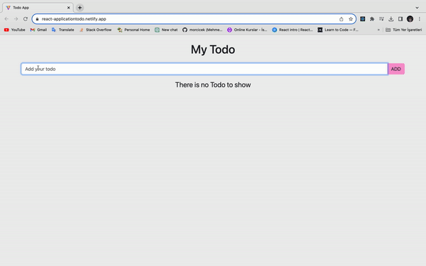

# Todo App

This is an application that I use React.js to save todos constantly with LocalStorage.

## Table of contents

- [Overview](#overview)
  - [Screenshot](#screenshot)
  - [Links](#links)
- [My process](#my-process)
  - [Built with](#built-with)
  - [What I learned](#what-i-learned)
  - [Continued development](#continued-development)
- [Author](#author)

## Overview

### Screenshot



### Links

- Live Site URL: [Todo App](https://react-applicationtodo.netlify.app/)

## My process

### Built with

- CSS custom properties
- Bootstrap
- Responsive Design
- JavaScript LocalStorage
- React.js useState
- React.js props
- React.js Icons
- React.js useEffect

### What I learned

I learned essential parts of React JS at this challenge such as props and adding components.Also I reinforced my knowledge about Bootstrap and React.
Apart from these I reviewed React.js basics and essentials.
To see how you can add code snippets, see below:

- HTML

```html
<body>
  <div id="root"></div>
  <script type="module" src="/src/main.jsx"></script>
</body>
```

- CSS

```
.btn-pink {
  background: #f798d0;
}

.btn-pink:hover {
  background: #ea40a4;
  color: #fff !important;
}

.cursor {
  cursor: pointer;
}

```

- JSX

```jsx
import { useEffect, useState } from 'react';
import TodoForm from './components/TodoForm';
import 'bootstrap/dist/css/bootstrap.min.css';
import Todo from './components/Todo';
import { v4 as uuidv4 } from 'uuid';

function App() {
  const [todos, setTodos] = useState([]);
  const [todoText, setTodoText] = useState('');
  const [edit, setEdit] = useState(false);
  const [willUpdateTodo, setWillUpdateTodo] = useState('');

  useEffect(() => {
    const todosFromLocalStorage = localStorage.getItem('todos');
    if (todosFromLocalStorage === null) {
      localStorage.setItem('todos', JSON.stringify([]));
    } else {
      setTodos(JSON.parse(todosFromLocalStorage));
    }
  }, []);

  const deleteTask = (id) => {
    const deletedTodo = todos.filter((el) => el.id !== id);
    setTodos(deletedTodo);
    localStorage.setItem('todos', JSON.stringify(deletedTodo));
  };

export default App;
```

### Continued development

- Responsive Design
- Bootstrap
- React

### Useful resources

- [React Documentation](https://react.dev/)
- [JavaScript MDN Documentation](https://developer.mozilla.org/en-US/docs/Web/JavaScript)
- [Bootstrap](https://getbootstrap.com/)

## Author

- Github - [morcicek](https://github.com/morcicek)
- Linkedin - [Mehmet Cevat Morcicek](https://linkedin.com/in/mehmet-cevat-morcicek-b50a29178)
- Twitter - [@morcicek_m](https://twitter.com/morcicek_m)
